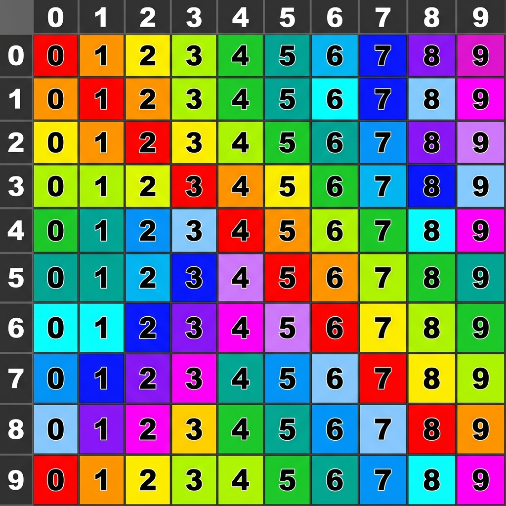

# Laboratorio Interactivo de Mapeo de Texturas 3D

Este es un proyecto educativo e interactivo desarrollado en **Three.js** y **Vite** para la asignatura de **Computación Gráfica (Computación Visual)**. Permite explorar de forma práctica y visual los conceptos fundamentales del mapeo de texturas en objetos 3D.

 *(Nota: Puedes usar el botón de captura de pantalla integrado para guardar tus configuraciones)*

---

## 🚀 Guía de Instalación y Ejecución

Sigue estos pasos para ejecutar la aplicación en tu entorno local:

### 1. Requisitos Previos
Asegúrate de tener instalado [Node.js](https://nodejs.org/) (versión 16 o superior recomendada).

### 2. Instalar Dependencias
Abre tu terminal en la carpeta raíz del proyecto (`mapeo-texturas-threejs`) y ejecuta:
```bash
npm install
```

### 3. Iniciar Servidor de Desarrollo
Ejecuta el servidor local de Vite:
```bash
npm run dev
```
La terminal te mostrará una dirección local (usualmente `http://localhost:5173`). Abre este enlace en tu navegador.

### 4. Compilar para Producción
Si deseas empaquetar la aplicación optimizada para producción:
```bash
npm run build
```
Los archivos de distribución se generarán en la carpeta `dist`.

---

## 📖 Conceptos Gráficos Demostrados

La aplicación cuenta con una guía educativa en el lateral izquierdo que permite entender y experimentar con los siguientes temas:

### 1. Coordenadas UV (UV Mapping)
* **¿Qué es?**: Las coordenadas UV representan la superficie 2D normalizada de un objeto en coordenadas $u$ (horizontal) y $v$ (vertical), ambas en el rango $[0.0, 1.0]$.
* **En la App**: Al seleccionar la textura **UV Grid**, verás líneas de coordenadas numéricas sobre las geometrías (Cubo, Esfera y Plano).
* **Qué observar**: Nota cómo la esfera presenta estiramientos de textura cerca de los polos (singularidad del mapeo esférico), mientras que el plano tiene un mapeo lineal sin distorsión.

### 2. Modos de Envoltura (Wrapping)
* **¿Qué es?**: Define el comportamiento del renderizador cuando las coordenadas UV asignadas a los vértices caen fuera del rango $[0.0, 1.0]$ (debido a factores de repetición/escala mayores a 1).
* **Modos Soportados**:
  * `RepeatWrapping`: La textura se repite infinitamente formando un mosaico regular.
  * `ClampToEdgeWrapping`: La textura se dibuja una sola vez y los píxeles de los bordes se extienden ("abrazan") infinitamente hacia el exterior.
* **Qué observar**: Configura `Repetición U` y `Repetición V` a `4.0` en la sección "Envoltura y Repetición" y cambia el modo de wrapping para ver cómo el patrón de ladrillos se repite en mosaico o se estira en las orillas.

### 3. Filtros de Textura (Minificación y Magnificación)
* **¿Qué es?**: La textura casi nunca coincide uno a uno con los píxeles de la pantalla.
  * **Magnificación**: El objeto está muy cerca y la textura debe estirarse.
  * **Minificación**: El objeto está muy lejos y la textura debe encogerse.
* **Filtros**:
  * `NearestFilter`: Toma el color del téctel más cercano (píxel de textura). Genera un aspecto nítido pero pixelado (estilo retro / pixel art).
  * `LinearFilter`: Promedia los 4 técteles más cercanos. Genera un aspecto difuminado y suave.
* **Qué observar**: Acércate mucho a la esfera y cambia entre ambos para ver cómo los bordes del grid se pixelan o se suavizan.

### 4. Mipmapping y Aliasing Óptico
* **¿Qué es?**: Al alejar un objeto texturizado, muchos píxeles de textura compiten por el mismo píxel de pantalla, produciendo ruido parpadeante (aliasing/shimmering). Mipmapping precalcula versiones reducidas a la mitad ($1/2, 1/4...$) de la textura y usa la versión óptima según la distancia.
* **Qué observar**: Rota la cámara o aléjate del objeto con el scroll del mouse. Desactiva la casilla **"Generar Mipmaps"** para observar el fuerte ruido visual y parpadeo al mover la cámara. Actívalo nuevamente con `LinearMipmapLinearFilter` para experimentar una interpolación trilineal sumamente estable y suave.

### 5. Filtrado Anisotrópico (Anisotropic Filtering)
* **¿Qué es?**: Los mipmaps estándar asumen que la textura se escala uniformemente. Sin embargo, al ver un plano inclinado desde un ángulo muy rasante (oblicuo), la proyección es trapezoidal. La anisotropía toma muestras en la dirección de la inclinación del ángulo visual para mantener la nitidez a lo lejos.
* **Qué observar**: Selecciona la geometría **Plano**, inclina la cámara hasta ver el plano casi horizontalmente hacia el fondo. Cambia entre **Anisotropía = 1x (Desactivada)** y **Anisotropía Máxima (ej. 16x)**. Verás cómo la textura de piedra lejana recupera nitidez al fondo con el filtro activado.

---

## 🛠️ Estructura del Código

La solución está desacoplada para facilitar su estudio y mantenibilidad académica:
* 📁 `src/public/textures/`: Contiene los archivos PNG de texturas generadas (Grid, Ladrillo, Madera, Piedra).
* 📁 `src/js/textures.js`: Módulo que maneja la carga asíncrona de texturas y encapsula las llamadas a la API de Three.js para modificar filtros, wrapping, anisotropía y mipmaps.
* 📁 `src/js/components/scene.js`: Inicializa la escena 3D, agrega iluminación estándar (`AmbientLight`, `DirectionalLight`, `PointLight`), crea las mallas geométricas, administra el ciclo de renderizado y monta los controles interactivos de `lil-gui`.
* 📁 `src/js/ui.js`: Controla el panel lateral educativo de HTML5, maneja los clics de pestañas, activa los presets de experimentación rápida y actualiza los valores del inspector en tiempo real mediante eventos.
* 📁 `src/scss/components/_dashboard.scss`: Aplica un diseño oscuro premium con efectos de desenfoque (glassmorphism) e interactividad responsive.

---

## 🧪 Pruebas Recomendadas para el Alumno
1. **Prueba de Estiramiento UV**: Geometría `Esfera` ➔ Textura `UV Grid`. Mira los polos superior e inferior de la esfera.
2. **Prueba de Límite**: Geometría `Cubo` ➔ Textura `Ladrillo` ➔ Repetición `3.0` ➔ Cambia a `ClampToEdgeWrapping`.
3. **Prueba de Ruido Visual**: Geometría `Plano` ➔ Textura `UV Grid` ➔ Desactiva `Generar Mipmaps` ➔ Filtro Min: `LinearFilter`. Aléjate con el scroll.
4. **Prueba de Nitidez Rasante**: Geometría `Plano` ➔ Textura `Piedra` ➔ Repetición `8.0` ➔ Inclina la cámara a ras de suelo ➔ Cambia anisotropía de `1x` a `16x`.
